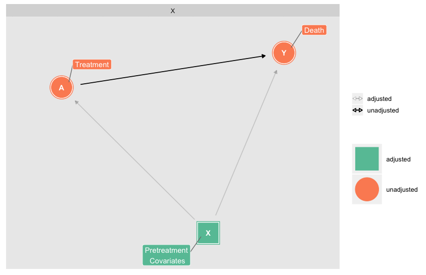
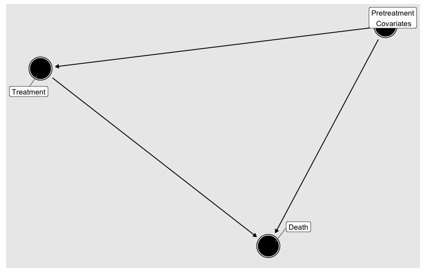
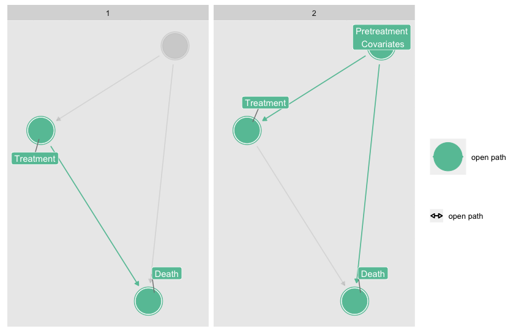
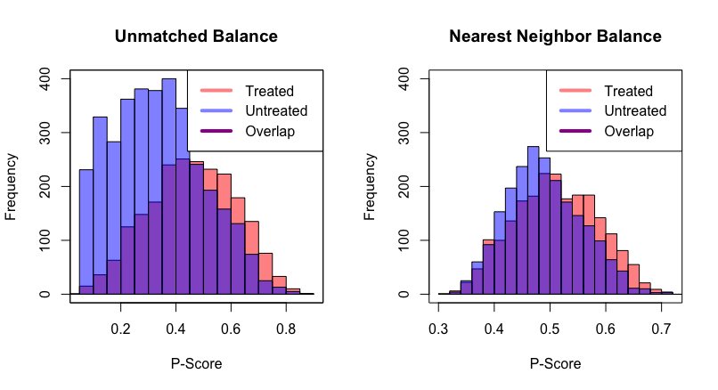

```{r setup, include=FALSE}
knitr::opts_chunk$set(echo = TRUE)
```

##Overview

Causal inference denotes a branch of statistics centered on identifying so-called _causal effects_. Through a rigorous framework, causal assumptions, and methodology, causal inference goes beyond the associations found in traditional inference, to then identify and quantify the _causal effect of an exposure on an outcome_ (@hernan). Applying these methods separates the statistical problem from the causal one, spells out the assumptions used to achieve a causal interpretation, and leads to a clearer understanding of when traditional statistical models can be thought of as causal. Below we illustrate some of the fundamental ideas and methods of the field along with a workflow through a simple example. Ultimately, we are ready to obtain the estimate of our causal effect once we have a diagram like the one below, along with any analogous derivations of the likelihood for the observed data.

<p align="center"></p>

```{r chunk, echo=FALSE}
#source("/Users/Raul/Desktop/Working/causal/code/causal_overview.R")
```

##Technical

All coding including this README file were generated through `R` and `RMarkdown`. In addition, this is a `packrat` project, which means that you may have to install the package `packrat` in an effort to ensure reproducibility. No seed was set for the generation of matched data, hence results may vary slightly across iterations.

##Code Overview

Coding in basic causal inference does not require many new computational skills besides the creation of DAGs through the `ggdag` package, or an understanding of matching algorithms in either the `MatchIt` or the `optmatch` package. Below are the core sections our code is broken into:

1. __Exploring open paths__ - initial relationship between covariates is posited through `dagify()`; all variations of the DAGs are created through various `ggdag_()` functions; all are part of the `ggdag` package.  
2. __Matching and visualizing quality__ - obtaining actual matches is done through the `MatchIt::matchit()` function (matching is slow); convenient table created through `tableone::CreateTableOne()`; `optmatch` package has nice utilities, but not utilized; visualization is a simple histogram.  
3. __Estimating causal effect__ - simple `t.test()`

##Causal workflow

Causal inference diverges from the usual workflow for investigators in a few key ways. Understanding this workflow requires some understanding of causal terminology which we will not cover; consult the references as needed. Here is a basic workflow for the simplest causal analysis:

1. Define causal effect of interest.  
2. Posit the relationships between the variables through a DAG. 
3. Make an adjustment such that the ignorability assumption i.e. the backdoor criterion is satisfied: $A \perp Y^0,Y^1|L$.  
4. Posit an appropriate model for the observed data if a simple adjustment like matching or weighting won't suffice, e.g. effect-modifiers, mediators, time-dependent confounding.   
5. Verify that the other causal assumptions, i.e SUVTA, consistency, and positivity are satisfied, if possible. 

 To demonstrate this workflow, consider this example dataset we load into __R__ directly from:  
<p align="center"></p>

Like most causal analysis, we are interested in the effect of our exposure (Treatment), on our outcome (Death). Here though, we observe that this effect is confounded by many other covariates, which if we fail to account for them prevent us from estimating this effect. Assuming our DAG is correct, we must now identify the minimal number of variables which, if we adjusted for them, would allow us to estimate our effect of interest, i.e. minimal adjustment set. This process is alternatively called achieving _d-separation_ , @pearl. Prior to identifying this set (see first figure), we illustrate the paths through which treatment may directly or indirectly affect death.

<p align="center"></p>

From this, it is easy to see that the set of pretreatment covariates make up the minimal adjustment set. In general, a great resource for understanding dags for different situation is posted below:  
<https://cran.r-project.org/web/packages/ggdag/vignettes/intro-to-dags.html>  

For our next step we choose matching to make the necessary adjustment. Matching itself requires certain decisions, such as which distance measure would one like to use, and what matching method. In our example, we choose the Manhanabolis distance measure and survey three different matching methods, nearest neighbor pair matching, optimal pair matching, and nearest neighbor matching with a propensity score caliper. In addition, we measure the quality of the matches through standardized mean differences. Below are the results across the pretreatment covariates:

|            | unmatched |   nn | optimal | nn\_caliper |
|-----------:|----------:|-----:|--------:|------------:|
|        ARF |      0.06 | 0.16 |    0.08 |        0.16 |
|        CHF |      0.10 | 0.00 |    0.12 |        0.00 |
|       Cirr |      0.14 | 0.00 |    0.15 |        0.00 |
|     colcan |      0.04 | 0.00 |    0.04 |        0.00 |
|       Coma |      0.21 | 0.00 |    0.21 |        0.00 |
|    lungcan |      0.10 | 0.00 |    0.09 |        0.00 |
|       MOSF |      0.02 | 0.00 |    0.01 |        0.00 |
|     sepsis |      0.41 | 0.18 |    0.42 |        0.18 |
|     female |      0.09 | 0.04 |    0.11 |        0.06 |
|        age |      0.06 | 0.04 |    0.05 |        0.04 |
|    meanbp1 |      0.46 | 0.17 |    0.46 |        0.16 |
|       aps1 |      0.50 | 0.20 |    0.49 |        0.20 |
| total\_smd |      2.18 | 0.79 |    2.22 |        0.80 |

From this we see that the optimal matching performs even worse than the optimal matched data, and the two nearest-neighor methods are nearly identical. For simplicity, we choose the first NN method. Below, we can assess the quality of the matches through a simple overlayed histogram. This figure represents the distribution of probabilities that someone dies according to their treatment assignments. We see good agreement between the two, from which we can practically consider the ignorability assumption satisfied. 

<p align="center"></p>

At this point, we are ready to obtain our causal estimate and its significance through a simple t-test. We find that those on treatment actually have a higher probability of death, and that this difference is statistically significant (see code). 

For this simplest of cases, we see the nuances in how a statistician would approach this investigation. In more realistic scenarios, our causal estimator of interest could be more complex requiring some derivations to obtain its asymptotic distribution for testing. We could have a combination of colliders, effect-modifiers, mediators, time-dependent confounding, dynamic treatment regimes forcing us to consider more complicated methods. In closing, causal inference for the first time introduces a new framework from which statisticians can more rigorously study potential scientific causes; actual causes, not just associations. 

##References